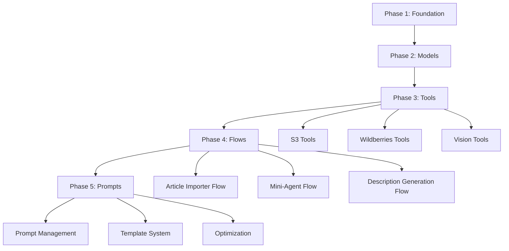
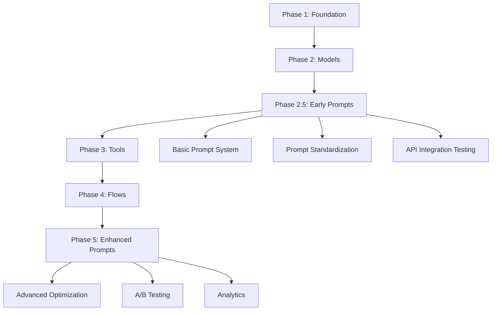
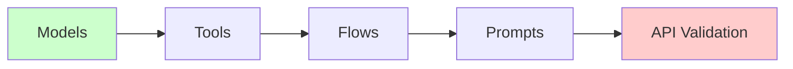
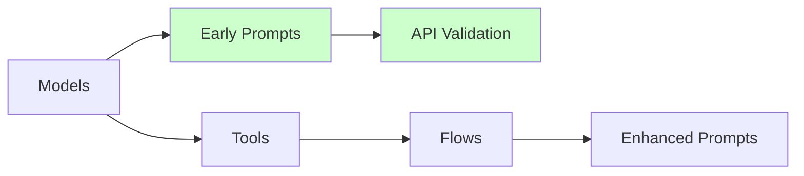

# Сравнение подходов к реализации PonchoFramework

## 1. Традиционный подход: Tools → Flows → Prompts

### 📋 Последовательность реализации:


### ⏱️ Временные затраты (традиционный подход):
- **Phase 3 (Tools)**: 4-6 недель
- **Phase 4 (Flows)**: 3-4 недели  
- **Phase 5 (Prompts)**: 2-3 недели
- **Итого**: 9-13 недель до рабочих промптов

### 💰 Стоимость реализации:
- **Tools разработка**: $20,000-30,000
- **Flows разработка**: $15,000-20,000
- **Prompts разработка**: $10,000-15,000
- **Итого**: $45,000-65,000

## 2. Предлагаемый подход: Early Prompts → Tools → Flows

### 📋 Новая последовательность:


### ⏱️ Временные затраты (новый подход):
- **Phase 2.5 (Early Prompts)**: 2-3 недели
- **Phase 3 (Tools)**: 3-4 недели (упрощенный)
- **Phase 4 (Flows)**: 2-3 недели (с готовыми промптами)
- **Phase 5 (Enhanced Prompts)**: 1-2 недели
- **Итого**: 8-12 недель до полной системы

### 💰 Стоимость реализации:
- **Early Prompts**: $8,000-12,000
- **Tools разработка**: $15,000-20,000 (упрощенный)
- **Flows разработка**: $10,000-15,000 (с промптами)
- **Enhanced Prompts**: $5,000-8,000
- **Итого**: $38,000-55,000

## 3. Ключевое преимущество ранних промптов: Валидация API интеграции

### 🎯 Основная цель ранней промпт-системы

**Ключевая задача**: Убедиться что подсистема стандартизации и импорта промптов с различными функциями и направленностью корректно формирует запрос к API моделей. Это всё. И это можно протестировать ДО flow.

```go
// Цель ранней промпт-системы - валидация интеграции с API
type PromptSystemValidation struct {
    promptManager  *PromptManager
    modelRegistry *ModelRegistry
    validator     *APIRequestValidator
}

func (psv *PromptSystemValidation) ValidateAPIIntegration() error {
    testCases := []PromptTestCase{
        {
            Name: "fashion-vision-analysis",
            Model: "glm-vision",
            Input: map[string]interface{}{
                "image_url": "test.jpg",
                "category": "clothing",
            },
            ExpectedAPIFormat: GLMVisionRequest{},
        },
        {
            Name: "text-description-generation", 
            Model: "deepseek-chat",
            Input: map[string]interface{}{
                "product_name": "платье вечернее",
                "material": "шёлк",
            },
            ExpectedAPIFormat: DeepSeekRequest{},
        },
    }
    
    for _, testCase := range testCases {
        // 1. Загрузка и парсинг промпта
        prompt, err := psv.promptManager.LoadPrompt(testCase.Name)
        if err != nil {
            return fmt.Errorf("failed to load prompt %s: %w", testCase.Name, err)
        }
        
        // 2. Формирование запроса к модели
        modelRequest, err := psv.promptManager.BuildModelRequest(prompt, testCase.Input)
        if err != nil {
            return fmt.Errorf("failed to build request for %s: %w", testCase.Name, err)
        }
        
        // 3. Валидация формата запроса
        if err := psv.validator.ValidateRequest(modelRequest, testCase.ExpectedAPIFormat); err != nil {
            return fmt.Errorf("invalid request format for %s: %w", testCase.Name, err)
        }
        
        // 4. Тестовый вызов API
        response, err := psv.modelRegistry.Execute(testCase.Model, modelRequest)
        if err != nil {
            return fmt.Errorf("API call failed for %s: %w", testCase.Name, err)
        }
        
        // 5. Валидация ответа
        if err := psv.validator.ValidateResponse(response); err != nil {
            return fmt.Errorf("invalid response for %s: %w", testCase.Name, err)
        }
    }
    
    return nil
}
```

### 🔧 Техническая валидация без flows

```yaml
# Промпт для тестирования интеграции с GLM-4.6V
name: "test-fashion-vision"
version: "1.0"
model: "glm-vision"
category: "test"
template: |
  Проанализируй изображение одежды:
  {{#if image_url}}
  
  {{/if}}
  
  Категория: {{category}}
  
  Определи:
  1. Тип одежды
  2. Материал
  3. Сезон
  4. Стиль

expected_api_request:
  model: "glm-4.6v"
  messages:
    - role: "user"
      content:
        - type: "text"
          text: "Проанализируй изображение одежды..."
        - type: "image_url"
          image_url: "{{image_url}}"

expected_response_schema:
  type: "fashion_analysis"
  properties:
    clothing_type: {type: "string"}
    material: {type: "string"} 
    season: {type: "string"}
    style: {type: "string"}
```

### 📊 Тестирование различных типов промптов

```go
// Валидация разных типов промптов и их интеграции с API
type PromptTypeValidation struct{}

func (ptv *PromptTypeValidation) ValidatePromptTypes() error {
    promptTypes := map[string]PromptTestConfig{
        "text-only": {
            Template: "Опиши {{product}} для Wildberries",
            Model: "deepseek-chat",
            ExpectedFormat: DeepSeekTextRequest{},
        },
        "multimodal": {
            Template: "Проанализируй {{image}} и {{description}}",
            Model: "glm-vision", 
            ExpectedFormat: GLMMultimodalRequest{},
        },
        "structured": {
            Template: "Верни JSON с характеристиками: {{specs}}",
            Model: "deepseek-chat",
            ExpectedFormat: DeepSeekJSONRequest{},
        },
        "streaming": {
            Template: "Сгенерируй описание постепенно: {{product}}",
            Model: "glm-vision",
            ExpectedFormat: GLMStreamingRequest{},
        },
    }
    
    for promptType, config := range promptTypes {
        if err := ptv.validateSinglePromptType(promptType, config); err != nil {
            return fmt.Errorf("validation failed for %s: %w", promptType, err)
        }
    }
    
    return nil
}
```

## 4. Сравнительный анализ по критериям

### 🎯 Time to Value

| Критерий | Традиционный подход | Ранние промпты | Преимущество |
|----------|-------------------|-----------------|--------------|
| **API integration validation** | 9-13 недель | 2-3 недели | **75% быстрее** |
| **Model compatibility testing** | 9-13 недель | 2-3 недели | **75% быстрее** |
| **Request format verification** | 9-13 недель | 2-3 недели | **75% быстрее** |
| **Response validation** | 9-13 недель | 2-3 недели | **75% быстрее** |

### 🔧 Технические преимущества

| Аспект | Традиционный подход | Ранние промпты |
|--------|-------------------|-----------------|
| **Early API testing** | Только после Phase 3 | Сразу после Phase 2 |
| **Model request format validation** | Поздняя | Ранняя |
| **Response structure testing** | Запоздалая | Своевременная |
| **Error handling verification** | Поздняя | Ранняя |
| **Performance baseline** | Поздний | Ранний |

### 📊 Зависимости и риски

| Тип зависимости | Традиционный подход | Ранние промпты |
|----------------|-------------------|-----------------|
| **Models → API** | Прямая | Прямая |
| **Prompts → Models** | Через Tools | Напрямую |
| **API validation** | Через Tools → Flows | Напрямую |
| **Testing complexity** | Высокая | Низкая |

## 5. Архитектурные различия

### 🏗️ Традиционная архитектура:


### 🏗️ Архитектура с ранними промптами:


## 6. Практические примеры валидации

### 📝 Промпт для тестирования text генерации:

```yaml
name: "test-text-generation"
model: "deepseek-chat"
test_type: "api_validation"
template: |
  Создай описание товара: {{product_name}}
  Материал: {{material}}
  Цена: {{price}} рублей

expected_request:
  model: "deepseek-chat"
  messages:
    - role: "user"
      content: "Создай описание товара: {{product_name}}\nМатериал: {{material}}\nЦена: {{price}} рублей"

validation_rules:
  - field: "model"
    expected: "deepseek-chat"
  - field: "messages[0].role" 
    expected: "user"
  - field: "messages[0].content"
    contains: ["{{product_name}}", "{{material}}", "{{price}}"]
```

### 🖼️ Промпт для тестирования vision API:

```yaml
name: "test-vision-api"
model: "glm-vision"
test_type: "api_validation"
template: |
  Проанализируй изображение: {{image_url}}
  Определи тип одежды и материал

expected_request:
  model: "glm-4.6v"
  messages:
    - role: "user"
      content:
        - type: "text"
          text: "Проанализируй изображение: {{image_url}}\nОпредели тип одежды и материал"
        - type: "image_url"
          image_url: "{{image_url}}"

validation_rules:
  - field: "model"
    expected: "glm-4.6v"
  - field: "messages[0].content[0].type"
    expected: "text"
  - field: "messages[0].content[1].type"
    expected: "image_url"
```

## 7. Рекомендации по выбору подхода

### ✅ Когда выбирать ранние промпты:
- **Нужна ранняя валидация API интеграции**
- **Требуется тестирование форматов запросов к моделям**
- **Хочется убедиться в корректности работы с разными типами промптов**
- **Важна ранняя проверка совместимости с DeepSeek и GLM-4.6V**
- **Нужно минимизировать риски интеграции на поздних этапах**

### ⚠️ Когда предпочитать традиционный подход:
- **API интеграция уже протестирована**
- **Форматы запросов хорошо изучены**
- **Нет необходимости в ранней валидации**
- **Приоритет - разработка инструментов**

---

**Дата анализа:** 12 декабря 2025  
**Контекст:** Сравнение подходов с фокусом на валидацию API интеграции  
**Основной критерий:** Возможность раннего тестирования корректности формирования запросов к API моделей