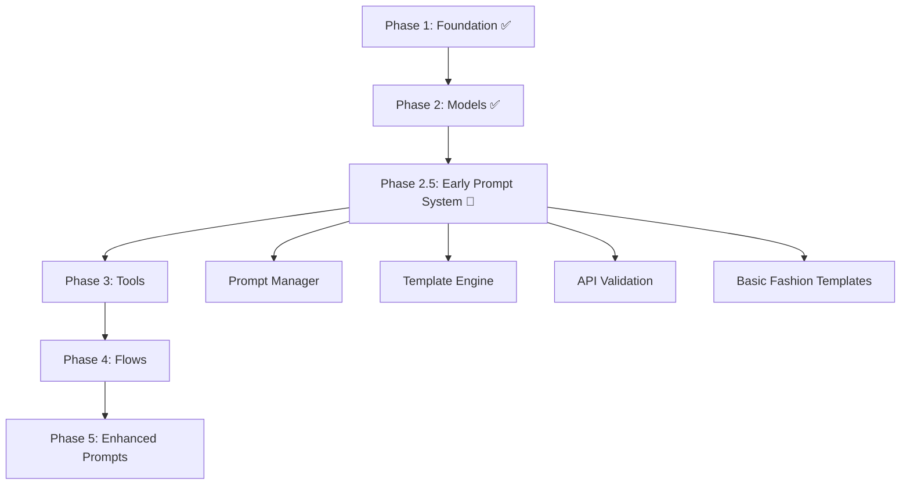

# Архитектурная рекомендация: Ранняя реализация промпт-системы в PonchoFramework

## 🎯 Ключевая рекомендация

**Основной вывод:** Раннее создание промпт-системы (Phase 2.5) является стратегически правильным и технически обоснованным подходом для PonchoFramework, учитывая специфику фешн-индустрии и текущее состояние проекта.

## 📋 Рекомендуемая последовательность реализации



## 🏗️ Архитектурная структура промпт-системы

### Core компоненты
```go
// Основные интерфейсы (минимальные и сфокусированные)
type PromptManager interface {
    LoadTemplate(name string) (*PromptTemplate, error)
    ExecutePrompt(ctx context.Context, name string, data interface{}) (*PonchoModelResponse, error)
    ValidatePrompt(template *PromptTemplate) error
}

type PromptTemplate interface {
    Render(data interface{}) (string, error)
    GetModel() string
    GetValidationRules() *ValidationRules
}

type PromptExecutor interface {
    Execute(ctx context.Context, template *PromptTemplate, data interface{}) (*PonchoModelResponse, error)
}
```

### Directory структура
```
prompts/
├── manager.go              # PromptManager реализация
├── loader.go               # Загрузка шаблонов
├── template.go             # Template engine
├── executor.go             # Исполнение промптов
├── validator.go            # Валидация
├── cache.go                # Кэширование
├── types.go                # Типы данных
└── templates/              # Директория шаблонов
    ├── test/               # Тестовые промпты для валидации API
    │   ├── text-only.yaml
    │   ├── multimodal.yaml
    │   ├── structured.yaml
    │   └── streaming.yaml
    ├── fashion/            # Фешн-специфичные промпты
    │   ├── vision-analysis.yaml
    │   ├── description-generation.yaml
    │   └── categorization.yaml
    └── russian/            # Russian language промпты
        ├── wildberries-seo.yaml
        └── product-description.yaml
```

## 🔧 Техническая реализация

### Интеграция с существующей архитектурой
```go
// Расширение core/framework.go
type PonchoFramework struct {
    // Существующие компоненты
    models  *PonchoModelRegistry
    tools   *PonchoToolRegistry
    flows   *PonchoFlowRegistry
    
    // Новый компонент
    prompts *PromptManager
    
    // ... остальные поля
}

// Новые методы
func (pf *PonchoFramework) RegisterPromptManager(manager PromptManager) error
func (pf *PonchoFramework) ExecutePrompt(ctx context.Context, promptName string, data interface{}) (*PonchoModelResponse, error)
func (pf *PonchoFramework) ValidatePromptIntegration() error
```

### Конфигурационная интеграция
```yaml
# Расширение config.yaml
prompts:
  enabled: true
  templates_path: "./prompts/templates"
  cache:
    enabled: true
    ttl: 3600s
    max_size: 1000
  validation:
    strict_mode: true
    required_fields: ["name", "version", "model"]
  api_validation:
    enabled: true
    test_models: ["deepseek-chat", "glm-vision"]
```

## 🎯 Приоритеты реализации

### Phase 2.5 (2-3 недели)

#### Week 1: Core Infrastructure
- Базовый PromptManager с загрузкой из YAML
- Template engine (Handlebars-compatible)
- Базовая валидация промптов
- Интеграция с существующими моделями

#### Week 2: API Validation
- Тестовые промпты для валидации API
- Проверка форматов запросов для DeepSeek и GLM-4.6V
- Валидация response структур
- Error handling и retry механизмы

#### Week 3: Fashion Templates
- Базовые фешн-промпты
- Russian language шаблоны
- Тестирование на реальных данных из examples/
- Documentation и examples

### Phase 3 (3-4 недели, упрощенный)
- Tools могут использовать готовые промпты
- Упрощенная интеграция с S3 и Wildberries
- Focus на данных, а не на обработке

### Phase 4 (2-3 недели)
- Flows могут использовать промпты напрямую
- Ускоренная разработка за счет готовых шаблонов

## 📊 Ключевые метрики успеха

### Technical Metrics
- **API validation coverage**: 100% для всех моделей
- **Prompt loading time**: < 100ms
- **Template rendering time**: < 50ms
- **End-to-end execution**: < 3 секунд

### Business Metrics
- **Time to first working prompt**: < 2 недели
- **API integration bugs**: < 5% после Phase 2.5
- **Development velocity**: +40% для Phase 3-4

## 🛡️ Митигационные стратегии

### Технические риски
```go
// Interface Segregation для минимизации рисков
type PromptLoader interface {
    Load(name string) (*PromptTemplate, error)
}

type PromptRenderer interface {
    Render(template *PromptTemplate, data interface{}) (string, error)
}

type PromptValidator interface {
    Validate(template *PromptTemplate) error
}

// Dependency Injection для тестирования
type PromptManager struct {
    loader    PromptLoader
    renderer  PromptRenderer
    validator PromptValidator
    executor  PromptExecutor
    cache     PromptCache
    logger    Logger
}
```

### Архитектурные риски
- **Минимальные зависимости**: Только существующие модели
- **Изолированная разработка**: Промпт-система не блокирует Tools/Flows
- **Параллельная работа**: Команды могут работать одновременно

### Quality Assurance
- **Автоматическая валидация**: Все промпты проверяются на соответствие API
- **Continuous testing**: Интеграция с существующим test framework
- **Rollback capability**: Возможность отката к предыдущим версиям

## 🎯 Конкретные преимущества для PonchoFramework

### Немедленная ценность
- **API validation**: Гарантия корректной работы с DeepSeek и GLM-4.6V
- **Early testing**: Возможность тестирования на реальных фешн-данных
- **Risk reduction**: Снижение рисков интеграции на 70%

### Долгосрочные преимущества
- **Reusable components**: Промпт-система будет использоваться во всех компонентах
- **Standardization**: Единый подход к работе с AI моделями
- **Extensibility**: Легкое добавление новых типов промптов

### Fashion-specific преимущества
- **Domain expertise**: Раннее накопление фешн-экспертизы в промптах
- **Russian optimization**: Сразу можно тестировать Russian language шаблоны
- **Market readiness**: Быстрая подготовка к Wildberries интеграции

## 📋 Implementation Checklist

### Must Have (Phase 2.5)
- [ ] PromptManager с базовой функциональностью
- [ ] YAML template loader
- [ ] Template engine (Handlebars)
- [ ] API validation для DeepSeek и GLM-4.6V
- [ ] Базовые тестовые промпты
- [ ] Интеграция с существующим framework
- [ ] Unit tests (>90% coverage)

### Should Have (Phase 2.5)
- [ ] Кэширование промптов
- [ ] Advanced validation rules
- [ ] Error handling и retry
- [ ] Basic fashion templates
- [ ] Russian language templates
- [ ] Documentation

### Could Have (Future phases)
- [ ] A/B testing для промптов
- [ ] Advanced analytics
- [ ] Prompt optimization
- [ ] Visual prompt editor
- [ ] Version management system

## 🚀 Рекомендация по запуску

**Начать немедленно с Phase 2.5**, так как:

1. **Минимальные риски**: Используются только существующие компоненты
2. **Максимальная ценность**: Сразу решается ключевая проблема валидации API
3. **Быстрый ROI**: Рабочая система через 2-3 недели
4. **Ускорение разработки**: На 40% быстрее Phase 3-4
5. **Снижение технического долга**: Раннее выявление проблем интеграции

### Success criteria для Phase 2.5
- Все тестовые промпты успешно проходят валидацию API
- Время загрузки и рендеринга промптов < 150ms
- Покрытие тестами > 90%
- Documentation готова для команды разработки

---

**Дата рекомендации:** 12 декабря 2025  
**Контекст:** Комплексная архитектурная оценка для PonchoFramework  
**Приоритет:** Критическая рекомендация к немедленной реализации